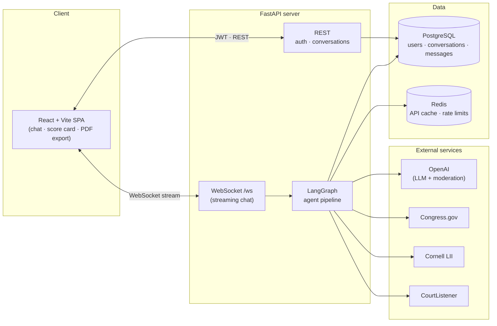
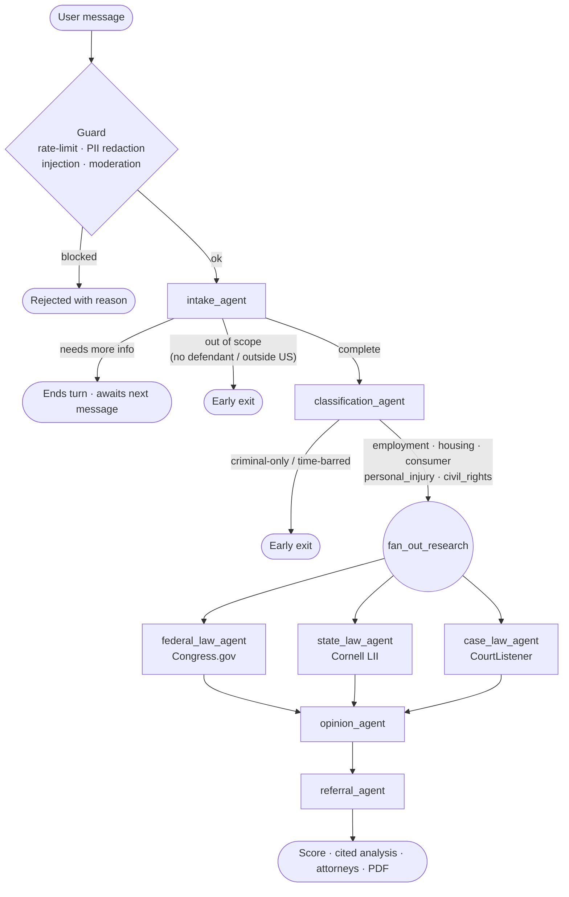

# ⚖️ LexAI — US Jurisdiction Assistant

**LexAI turns "I think something illegal happened to me" into a structured, cited legal analysis.**

Describe your situation in plain language and LexAI walks you through intake, figures out what kind of case it is, researches the **federal** and **state** statutes and **real court precedents** that apply, gives you a **0–100 case-strength score** with honest risks, recommends next steps, and points you to **attorneys and legal-aid resources** near you — then exports the whole thing as a polished **PDF**.

Behind the chat is a [LangGraph](https://langchain-ai.github.io/langgraph/) pipeline of specialized agents that research in parallel and stream their reasoning back token-by-token over a WebSocket.

> **Disclaimer:** LexAI is an AI research tool, not a law firm. Its output is informational only, is not legal advice, and creates no attorney-client relationship.

---

## ✨ Highlights

- **Multi-agent pipeline** — intake → triage classification → *parallel* legal research → synthesized opinion → attorney referral, orchestrated with LangGraph.
- **Grounded, cited case law** — case precedents come from real CourtListener search results with **clickable links**; the opinion is instructed to cite *only* retrieved authorities, so it doesn't invent cases.
- **Case-strength score (0–100)** — an at-a-glance read on legal merit, rendered as an animated gauge in the UI and an SVG donut in the PDF.
- **Smart triage / early exits** — politely bows out of out-of-scope matters (no identifiable defendant, incident outside the US, criminal-only, or likely time-barred) instead of inventing an answer.
- **Real-time streaming** — responses stream over WebSocket with a live typing indicator.
- **Professional PDF reports** — generated from an HTML/CSS template via WeasyPrint (matter caption, score gauge, linked authorities, attorney cards).
- **Safety & privacy by default** — prompt-injection guard, OpenAI moderation, Redis rate limiting, and PII redaction (SSNs, cards, emails, phones) *before* anything is stored or sent to the LLM.
- **Demo mode** — flip one env var to serve realistic mock legal data so the app never breaks on stage, even without external API keys.

---

## 🏗️ Architecture



### Agent pipeline

Every user message passes through the safety layer, then drives the graph. The graph runs **once per message** — if intake needs more info it ends the turn and resumes on your next reply (state persisted via LangGraph's checkpointer).



| Agent | Role | Source |
|-------|------|--------|
| `intake_agent` | Collects the 5 facts (incident, location, state, perpetrator, proof, date) one at a time; compresses long histories without losing collected fields | LLM |
| `classification_agent` | Triages into `employment` · `housing` · `consumer` · `personal_injury` · `civil_rights`, and gates criminal-only / time-barred matters | LLM |
| `federal_law_agent` | Applicable federal statutes | Congress.gov |
| `state_law_agent` | Applicable state statutes | Cornell LII |
| `case_law_agent` | Relevant precedent (distills the incident into a focused legal query first) | CourtListener |
| `opinion_agent` | Synthesizes a cited opinion + 0–100 strength score; cites only retrieved authorities | LLM |
| `referral_agent` | Attorney + legal-aid resources, specialty driven by the classification bucket | Justia · Google Maps · state bar · LawHelp |

All agents share one `AgentState` (the "whiteboard") defined in `backend/app/agents/state.py`; the streaming callback is passed via LangGraph config so it never breaks checkpoint serialization.

---

## 🧰 Tech stack

| Layer | Choice |
|-------|--------|
| **Frontend** | React 19 + Vite + TypeScript + Tailwind CSS (WebSocket streaming, react-markdown, framer-motion) |
| **API** | FastAPI (async) + Uvicorn — REST + WebSocket |
| **Agents** | LangGraph + LangChain, OpenAI models |
| **Database** | PostgreSQL via async SQLAlchemy |
| **Cache / limits** | Redis (legal-API response cache + per-user rate limiting) |
| **Auth** | JWT (python-jose) + bcrypt (passlib) |
| **PDF** | HTML/CSS → PDF via WeasyPrint |
| **Safety** | Prompt-injection guard · OpenAI moderation · rate limiting · PII redaction |
| **Tooling** | [uv](https://docs.astral.sh/uv/) packaging · ruff · pre-commit · Docker Compose |

---

## 🚀 Quickstart

```bash
# 1. Install backend deps, the git hook, and frontend deps
make install

# 2. Create env files (backend/.env + frontend/.env)
make env

# 3. Add your OpenAI key to backend/.env  (SECRET_KEY is auto-suggested below)
#    OPENAI_API_KEY=sk-...
#    SECRET_KEY=$(python3 -c "import secrets; print(secrets.token_hex(32))")

# 4. Run everything: Postgres + Redis + server (Docker) and the frontend (Vite)
make dev
```

Then open the frontend (Vite prints the URL, usually **http://localhost:5173**). The API + Swagger docs are at **http://localhost:8000/docs**.

> **Demo mode:** `backend/.env` ships with `DEMO_MODE=True`, which serves realistic mock data for the legal APIs (great for offline demos). Set `DEMO_MODE=False` for live Congress.gov / Cornell / CourtListener results, then recreate the server: `docker compose up -d --force-recreate server`.

---

## 🛠️ Prerequisites

- [**Docker**](https://docs.docker.com/get-docker/) + Docker Compose
- [**uv**](https://docs.astral.sh/uv/getting-started/installation/) — only for running the server on your host; it also manages the Python version, so you don't need Python 3.12 preinstalled
- [**Node.js**](https://nodejs.org/) 20+ (for the frontend)
- An **OpenAI API key** (required). Congress.gov / Google Maps keys are optional — without them those features use demo/fallback data.
- **PDF export (WeasyPrint)** needs Pango/cairo system libraries. The Docker image installs them automatically. For **host** runs install once — macOS: `brew install pango`; Debian/Ubuntu: `apt-get install libpango-1.0-0 libpangocairo-1.0-0`. On Apple Silicon, `make run` sets the Homebrew lib path for you.

---

## ⚙️ Setup details

### Environment

`make env` creates `backend/.env` and `frontend/.env` from their examples. In `backend/.env` set at minimum:

- `OPENAI_API_KEY` — required for the agents
- `SECRET_KEY` — `python3 -c "import secrets; print(secrets.token_hex(32))"`

Leave `frontend/.env`'s `VITE_API_URL` **empty** in development — the Vite dev server proxies `/auth`, `/conversations`, and `/ws` to the backend (see `vite.config.ts`), which avoids CORS.

> Inside Docker Compose, `DATABASE_URL` / `REDIS_URL` are overridden to the `postgres` / `redis` service names automatically — the `localhost` values in `.env` are correct for host runs.

### Run options

| Command | What it does |
|---------|--------------|
| `make dev` | **Everything**: Postgres + Redis + server in Docker, frontend dev server in the foreground |
| `make up` | Full backend stack in Docker (no frontend) |
| `make up-infra` | Just Postgres + Redis |
| `make run` | Backend on your host with auto-reload (needs `make up-infra`) |
| `make fe-dev` | Frontend dev server only |

---

## 🔒 Safety & privacy

Every inbound message is processed by `backend/app/middleware/prompt_guard.py` **before** it reaches storage or the LLM:

1. **PII redaction** — SSNs, payment cards (Luhn-validated), emails, and phone numbers are masked so raw secrets never hit Postgres or OpenAI. Legal facts (names, dates, locations, citations) are preserved on purpose.
2. **Rate limiting** — Redis fixed-window, 20 messages/min per user.
3. **Prompt-injection guard** — blocks jailbreak / instruction-override patterns (but *not* legal vocabulary like "assault" — a victim must be able to describe what happened).
4. **Moderation** — OpenAI's moderation endpoint, scoped to genuine misuse categories only.

The opinion agent is grounded (cites only retrieved authorities) and every report carries a legal disclaimer.

---

## 🗂️ Project structure

```
.
├── Makefile                    # dev command shortcuts (run `make help`)
├── docker-compose.yml          # postgres + redis + server
├── .pre-commit-config.yaml     # ruff lint/format + hygiene hooks
├── backend/
│   ├── Dockerfile              # uv-based image (+ WeasyPrint system libs)
│   ├── pyproject.toml          # deps + ruff config (managed by uv)
│   ├── uv.lock                 # pinned, reproducible versions
│   ├── scripts/                # run_workflow.py, ws_smoke.py (manual testing)
│   └── app/
│       ├── main.py             # FastAPI app + lifespan
│       ├── config.py           # settings from .env
│       ├── database.py         # async SQLAlchemy engine/session
│       ├── redis_client.py     # Redis connection + cache helpers
│       ├── agents/             # LangGraph agents, graph wiring, shared state
│       ├── routers/            # auth, conversations, chat (WebSocket)
│       ├── tools/              # external legal-API clients
│       ├── models/             # SQLAlchemy ORM models
│       ├── schemas/            # Pydantic request/response models
│       ├── middleware/         # prompt guard (safety + PII)
│       └── utils/              # auth, PDF export, PII redaction
└── frontend/                   # React + Vite + TypeScript + Tailwind SPA
    └── src/{components,hooks,pages,services,types}
```

---

## 🧑‍💻 Developer commands

Run `make help` for the full list. Common ones:

```bash
make install     # backend deps + git hook + frontend deps
make dev         # run the whole stack + frontend
make lint        # ruff lint (backend)        make fe-lint   # eslint (frontend)
make fix         # ruff autofix + format      make fe-build  # production build
make pre-commit  # run all git hooks          make logs      # tail server logs
make reset       # wipe DB/cache and rebuild
```

**Code quality:** ruff + a pre-commit hook (lint/format scoped to `backend/`) are installed by `make install`; commits auto-format staged files.

---

## 🧪 Testing the agent workflow

No external services or auth needed — two scripts drive the pipeline directly.

**Drive the graph** (`backend/scripts/run_workflow.py`) — a simulated multi-turn conversation that runs until intake completes or the pipeline early-exits:

```bash
make smoke-mock                 # all scenarios, stubbed LLM — deterministic & offline
make smoke SCENARIO=partial     # real LLM (a persona answers intake's questions)
```

| Scenario | Exercises | Expected |
|----------|-----------|----------|
| `complete` | all facts up front | full pipeline → referral |
| `partial` | missing the date | multi-turn → full pipeline |
| `no-perp` | no identifiable defendant | early exit at intake |
| `outside-us` | incident outside the US | early exit at intake |
| `criminal` | criminal-only matter | early exit at classification |

**End-to-end over the real API** (`backend/scripts/ws_smoke.py`) — signs up, opens the WebSocket, and streams a real chat turn (needs the stack running):

```bash
make smoke-ws
```

---

## 📄 License

Built for a hackathon. Provided as-is for educational and demonstration purposes — **not legal advice**.
